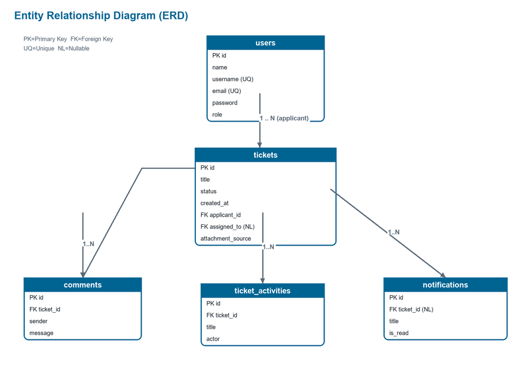

# Dokumentasi Database — E-Ticketing Helpdesk UTS

**Versi:** 1.0.0
**DBMS acuan:** MySQL 8.x / MariaDB (kompatibel PostgreSQL dengan sedikit penyesuaian)
**Sumber kebenaran model:** `domain/model/Ticket.kt`

Dokumen ini memuat **skema relasional** (DDL `CREATE TABLE`), **penjelasan tiap tabel/kolom**,
**diagram ERD**, dan **seed data** yang identik dengan data dummy aplikasi
(`FakeTicketRepository.kt` & `TicketViewModel.kt`). Gunakan DDL di bawah untuk membuat tabel
di phpMyAdmin / MySQL Workbench / DBeaver, lalu **screenshot tabel** untuk lampiran UAS.

---

## 1. Ringkasan Tabel

| Tabel | Fungsi | Relasi utama |
|-------|--------|--------------|
| `users` | Data akun pengguna (USER/HELPDESK/ADMIN) | 1 user → banyak tiket |
| `tickets` | Tiket helpdesk | milik 1 user, di-assign ke 1 helpdesk |
| `comments` | Balasan / diskusi pada tiket | banyak komentar → 1 tiket |
| `ticket_activities` | Riwayat aktivitas tiket (audit trail) | banyak aktivitas → 1 tiket |
| `notifications` | Notifikasi dalam aplikasi | opsional terkait 1 tiket |

---

## 2. Diagram ERD



```
┌─────────────────────┐
│        users        │
├─────────────────────┤
│ PK id               │
│    name             │
│    username  (UQ)   │
│    email     (UQ)   │
│    password         │
│    role             │  enum(USER,HELPDESK,ADMIN)
└─────────┬───────────┘
          │ 1
          │
          │ N (applicant_id)         ┌──── N (assigned_to) ──┐
          ▼                          │                       │
┌─────────────────────┐             │                       │
│       tickets        │◄────────────┘  (assigned_to → users.id, nullable)
├─────────────────────┤
│ PK id               │
│    title            │
│    description      │
│    status           │  enum(OPEN,IN_PROGRESS,CLOSED)
│    created_at       │
│ FK applicant_id     │──► users.id
│ FK assigned_to (NL) │──► users.id
│    attachment_source│  enum(NONE,CAMERA,FILE)
│    attachment_name  │
└───┬─────────────┬───┘
    │ 1           │ 1
    │             │
    │ N           │ N
    ▼             ▼
┌──────────┐  ┌──────────────────┐      ┌──────────────────────┐
│ comments │  │ ticket_activities│      │     notifications     │
├──────────┤  ├──────────────────┤      ├──────────────────────┤
│ PK id    │  │ PK id            │      │ PK id                 │
│ FK ticket│  │ FK ticket_id     │      │    title              │
│   sender │  │    title         │      │    message            │
│   message│  │    actor         │      │    created_at         │
│ timestamp│  │    timestamp     │      │ FK ticket_id (NL) ────┼──► tickets.id
└──────────┘  └──────────────────┘      │    is_read            │
                                         └──────────────────────┘

Keterangan: PK=Primary Key, FK=Foreign Key, UQ=Unique, NL=Nullable
```

**Kardinalitas:**
- `users (1) — (N) tickets` melalui `applicant_id` (pembuat tiket)
- `users (1) — (N) tickets` melalui `assigned_to` (petugas, opsional)
- `tickets (1) — (N) comments`
- `tickets (1) — (N) ticket_activities`
- `tickets (1) — (N) notifications` (opsional; `ticket_id` boleh NULL)

---

## 3. DDL — CREATE TABLE (MySQL / MariaDB)

```sql
-- ============================================================
--  E-Ticketing Helpdesk UTS - Skema Database
-- ============================================================
CREATE DATABASE IF NOT EXISTS helpdesk_uts
  CHARACTER SET utf8mb4 COLLATE utf8mb4_unicode_ci;
USE helpdesk_uts;

-- ----------------------------------------------------------------
-- Tabel: users
-- ----------------------------------------------------------------
CREATE TABLE users (
    id          VARCHAR(20)  NOT NULL,
    name        VARCHAR(100) NOT NULL,
    username    VARCHAR(50)  NOT NULL,
    email       VARCHAR(100) NOT NULL,
    password    VARCHAR(255) NOT NULL,                 -- simpan hash (BCrypt) di produksi
    role        ENUM('USER','HELPDESK','ADMIN') NOT NULL DEFAULT 'USER',
    created_at  DATETIME     NOT NULL DEFAULT CURRENT_TIMESTAMP,
    PRIMARY KEY (id),
    UNIQUE KEY uq_users_username (username),
    UNIQUE KEY uq_users_email (email)
) ENGINE=InnoDB;

-- ----------------------------------------------------------------
-- Tabel: tickets
-- ----------------------------------------------------------------
CREATE TABLE tickets (
    id                VARCHAR(20)   NOT NULL,
    title             VARCHAR(100)  NOT NULL,
    description       TEXT          NOT NULL,
    status            ENUM('OPEN','IN_PROGRESS','CLOSED') NOT NULL DEFAULT 'OPEN',
    created_at        DATETIME      NOT NULL DEFAULT CURRENT_TIMESTAMP,
    applicant_id      VARCHAR(20)   NOT NULL,
    assigned_to       VARCHAR(20)   NULL,
    attachment_source ENUM('NONE','CAMERA','FILE') NOT NULL DEFAULT 'NONE',
    attachment_name   VARCHAR(255)  NULL,
    PRIMARY KEY (id),
    KEY idx_tickets_status (status),
    KEY idx_tickets_applicant (applicant_id),
    CONSTRAINT fk_tickets_applicant
        FOREIGN KEY (applicant_id) REFERENCES users(id)
        ON UPDATE CASCADE ON DELETE RESTRICT,
    CONSTRAINT fk_tickets_assignee
        FOREIGN KEY (assigned_to) REFERENCES users(id)
        ON UPDATE CASCADE ON DELETE SET NULL
) ENGINE=InnoDB;

-- ----------------------------------------------------------------
-- Tabel: comments
-- ----------------------------------------------------------------
CREATE TABLE comments (
    id         VARCHAR(20)  NOT NULL,
    ticket_id  VARCHAR(20)  NOT NULL,
    sender     VARCHAR(100) NOT NULL,
    message    TEXT         NOT NULL,
    created_at DATETIME     NOT NULL DEFAULT CURRENT_TIMESTAMP,
    PRIMARY KEY (id),
    KEY idx_comments_ticket (ticket_id),
    CONSTRAINT fk_comments_ticket
        FOREIGN KEY (ticket_id) REFERENCES tickets(id)
        ON UPDATE CASCADE ON DELETE CASCADE
) ENGINE=InnoDB;

-- ----------------------------------------------------------------
-- Tabel: ticket_activities (audit trail)
-- ----------------------------------------------------------------
CREATE TABLE ticket_activities (
    id         VARCHAR(20)  NOT NULL,
    ticket_id  VARCHAR(20)  NOT NULL,
    title      VARCHAR(255) NOT NULL,
    actor      VARCHAR(100) NOT NULL,
    created_at DATETIME     NOT NULL DEFAULT CURRENT_TIMESTAMP,
    PRIMARY KEY (id),
    KEY idx_activities_ticket (ticket_id),
    CONSTRAINT fk_activities_ticket
        FOREIGN KEY (ticket_id) REFERENCES tickets(id)
        ON UPDATE CASCADE ON DELETE CASCADE
) ENGINE=InnoDB;

-- ----------------------------------------------------------------
-- Tabel: notifications
-- ----------------------------------------------------------------
CREATE TABLE notifications (
    id         VARCHAR(20)  NOT NULL,
    title      VARCHAR(150) NOT NULL,
    message    VARCHAR(255) NOT NULL,
    created_at DATETIME     NOT NULL DEFAULT CURRENT_TIMESTAMP,
    ticket_id  VARCHAR(20)  NULL,
    is_read    BOOLEAN      NOT NULL DEFAULT FALSE,
    PRIMARY KEY (id),
    KEY idx_notifications_ticket (ticket_id),
    CONSTRAINT fk_notifications_ticket
        FOREIGN KEY (ticket_id) REFERENCES tickets(id)
        ON UPDATE CASCADE ON DELETE CASCADE
) ENGINE=InnoDB;
```

---

## 4. Penjelasan Kolom

### 4.1 `users`
| Kolom | Tipe | Keterangan |
|-------|------|------------|
| `id` | VARCHAR(20) PK | ID unik, contoh `U-001`, `H-001`, `A-001` |
| `name` | VARCHAR(100) | Nama lengkap |
| `username` | VARCHAR(50) UQ | Dipakai untuk login |
| `email` | VARCHAR(100) UQ | Email kampus |
| `password` | VARCHAR(255) | **Wajib hash** (BCrypt/Argon2) di produksi |
| `role` | ENUM | `USER`, `HELPDESK`, atau `ADMIN` |

### 4.2 `tickets`
| Kolom | Tipe | Keterangan |
|-------|------|------------|
| `id` | VARCHAR(20) PK | Contoh `T-001` |
| `title` | VARCHAR(100) | Judul tiket (5–100 karakter) |
| `description` | TEXT | Deskripsi masalah (10–1000 karakter) |
| `status` | ENUM | `OPEN` → `IN_PROGRESS` → `CLOSED` |
| `applicant_id` | FK → users.id | Pembuat tiket |
| `assigned_to` | FK → users.id (NULL) | Petugas helpdesk yang menangani |
| `attachment_source` | ENUM | `NONE` / `CAMERA` / `FILE` |
| `attachment_name` | VARCHAR(255) NULL | Nama berkas lampiran |

### 4.3 `comments`
Balasan pada tiket. `sender` disimpan sebagai nama untuk kemudahan tampilan
(boleh diubah menjadi FK `user_id` bila ingin normalisasi penuh).

### 4.4 `ticket_activities`
Riwayat/log perubahan tiket (dibuat otomatis saat status diubah, di-assign, atau ada komentar).

### 4.5 `notifications`
Notifikasi in-app. `ticket_id` boleh NULL untuk notifikasi umum. `is_read` menandai sudah dibaca.

---

## 5. Seed Data (sesuai data dummy aplikasi)

```sql
-- Users (password '123456' — di produksi gunakan hash)
INSERT INTO users (id, name, username, email, password, role) VALUES
('U-001','Ahmad Dani','ahmad','ahmad@campus.ac.id','123456','USER'),
('U-002','Siti Aminah','siti','siti@campus.ac.id','123456','USER'),
('U-003','Budi Utomo','budi','budi@campus.ac.id','123456','USER'),
('H-001','Rina Helpdesk','helpdesk','helpdesk@campus.ac.id','123456','HELPDESK'),
('H-002','Arif Helpdesk','arif','arif@campus.ac.id','123456','HELPDESK'),
('A-001','Admin UTS','admin','admin@campus.ac.id','123456','ADMIN');

-- Tickets
INSERT INTO tickets (id,title,description,status,created_at,applicant_id,assigned_to,attachment_source,attachment_name) VALUES
('T-001','Koneksi Internet Putus','Internet di lantai 2 mati total.','OPEN','2026-04-08 09:00','U-001',NULL,'FILE','log-internet.png'),
('T-002','Layar Monitor Berkedip','Monitor sering mati sendiri saat dipakai.','IN_PROGRESS','2026-04-07 14:20','U-002','H-001','NONE',NULL),
('T-003','Install Software Design','Butuh Adobe Suite untuk keperluan desain.','CLOSED','2026-04-06 10:00','U-003','H-002','NONE',NULL);

-- Comments
INSERT INTO comments (id,ticket_id,sender,message,created_at) VALUES
('C-001','T-001','Ahmad Dani','Internet mati sejak pagi.','2026-04-08 09:02'),
('C-002','T-002','Rina Helpdesk','Sudah saya jadwalkan pengecekan onsite.','2026-04-07 15:00');

-- Ticket Activities
INSERT INTO ticket_activities (id,ticket_id,title,actor,created_at) VALUES
('A-001','T-001','Tiket dibuat','Ahmad Dani','2026-04-08 09:00'),
('A-002','T-002','Tiket dibuat','Siti Aminah','2026-04-07 14:20'),
('A-003','T-002','Status diubah menjadi IN_PROGRESS','Rina Helpdesk','2026-04-07 14:45'),
('A-004','T-002','Tiket di-assign ke Rina Helpdesk','Admin UTS','2026-04-07 14:46'),
('A-005','T-003','Tiket dibuat','Budi Utomo','2026-04-06 10:00'),
('A-006','T-003','Status diubah menjadi IN_PROGRESS','Arif Helpdesk','2026-04-06 10:30'),
('A-007','T-003','Status diubah menjadi CLOSED','Arif Helpdesk','2026-04-06 11:10');

-- Notifications
INSERT INTO notifications (id,title,message,created_at,ticket_id,is_read) VALUES
('N-001','Update Status','T-002 sedang ditangani helpdesk','2026-04-07 14:50','T-002',FALSE),
('N-002','Tiket Selesai','T-003 sudah diselesaikan','2026-04-06 11:11','T-003',TRUE);
```

---

## 6. Contoh Query untuk Screenshot

```sql
-- Tampilkan semua tiket beserta nama pembuat & petugas
SELECT t.id, t.title, t.status, u.name AS pembuat, h.name AS petugas
FROM tickets t
JOIN users u  ON t.applicant_id = u.id
LEFT JOIN users h ON t.assigned_to = h.id
ORDER BY t.created_at DESC;

-- Jumlah tiket per status (untuk dashboard)
SELECT status, COUNT(*) AS jumlah FROM tickets GROUP BY status;

-- Lihat isi tiap tabel (untuk lampiran screenshot UAS)
SELECT * FROM users;
SELECT * FROM tickets;
SELECT * FROM comments;
SELECT * FROM ticket_activities;
SELECT * FROM notifications;
```

---

## 7. Langkah Membuat Screenshot Tabel (untuk UAS)

1. Buka **phpMyAdmin** (XAMPP/Laragon) atau **MySQL Workbench**.
2. Jalankan DDL pada Bagian 3 → lalu seed data Bagian 5.
3. Buka tiap tabel (`users`, `tickets`, `comments`, `ticket_activities`, `notifications`).
4. Screenshot tampilan **Structure** (struktur kolom) dan **Browse** (isi data) tiap tabel.
5. Simpan screenshot ke folder lampiran dokumentasi UAS.

> Catatan: Aplikasi Android saat ini menggunakan data dummy in-memory (`FakeTicketRepository`).
> Skema di atas adalah representasi database backend yang setara dengan model data aplikasi,
> sehingga dapat langsung digunakan saat integrasi backend nyata (Retrofit + REST API).
