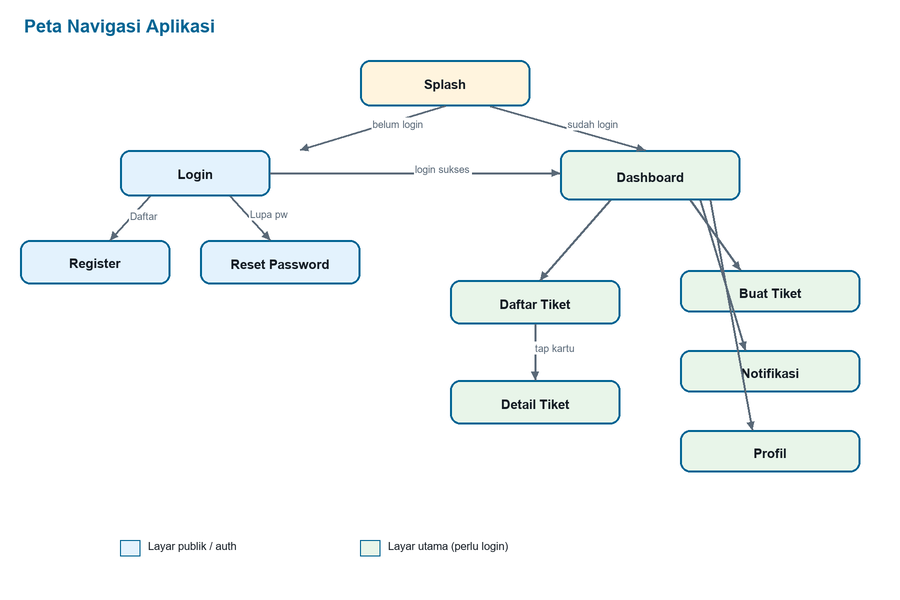
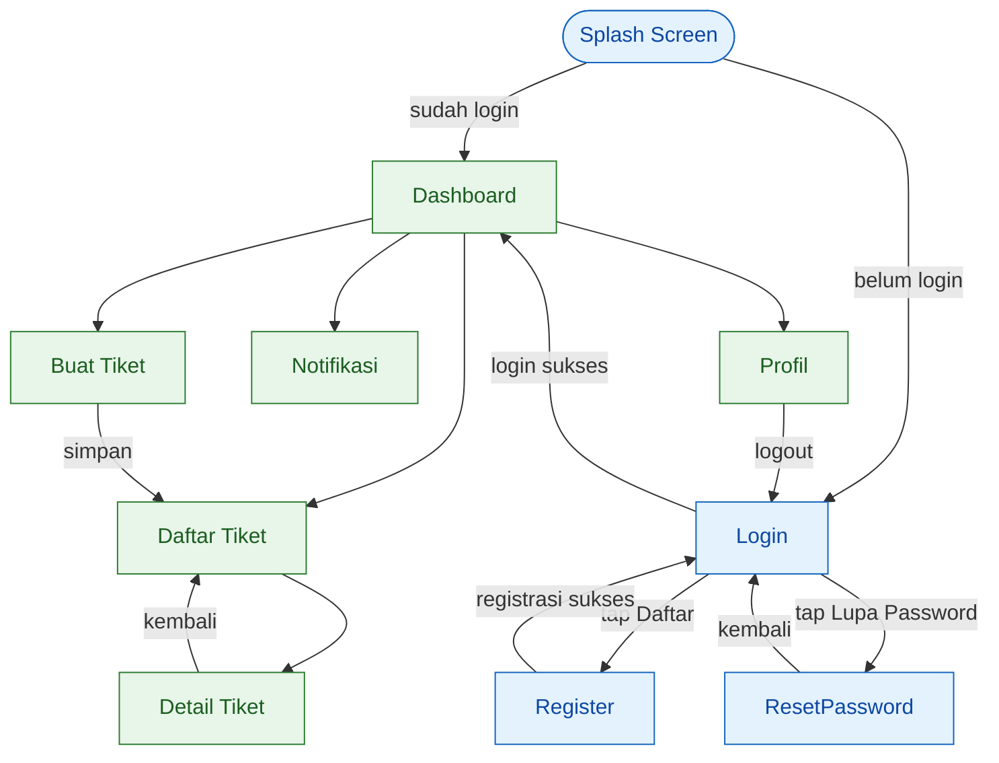
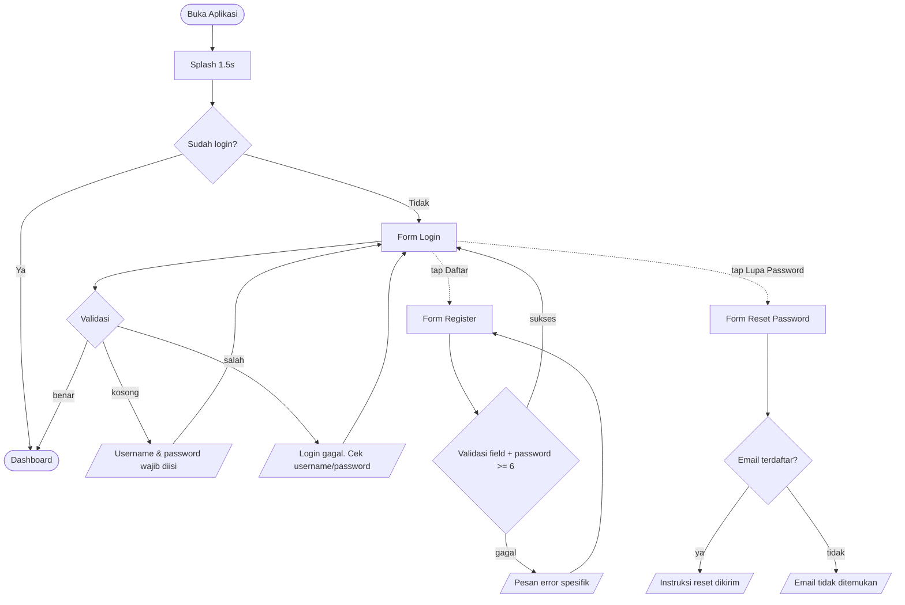
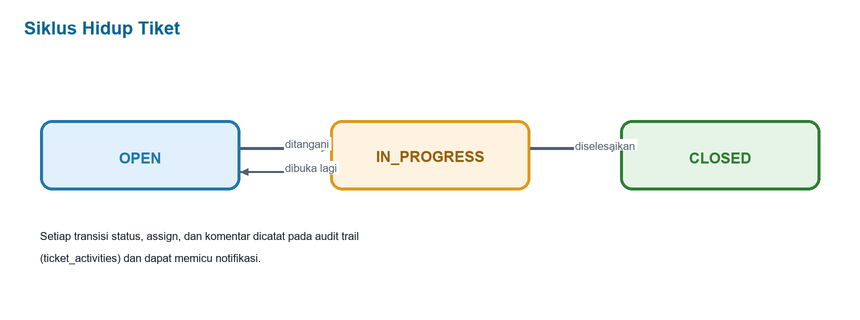
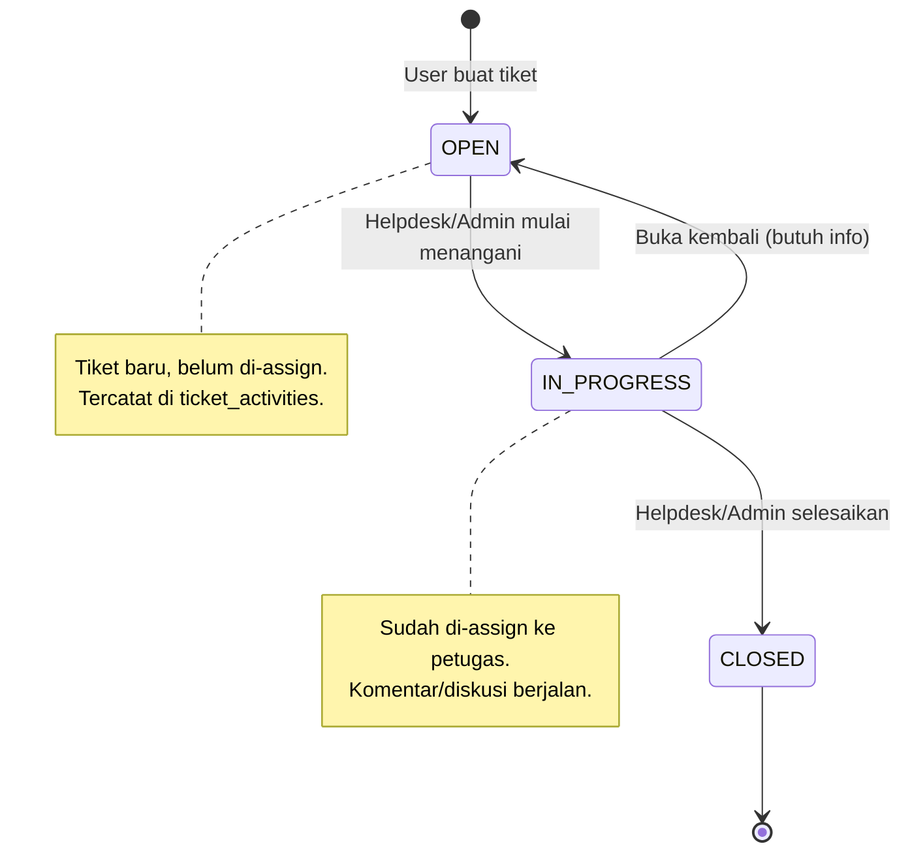
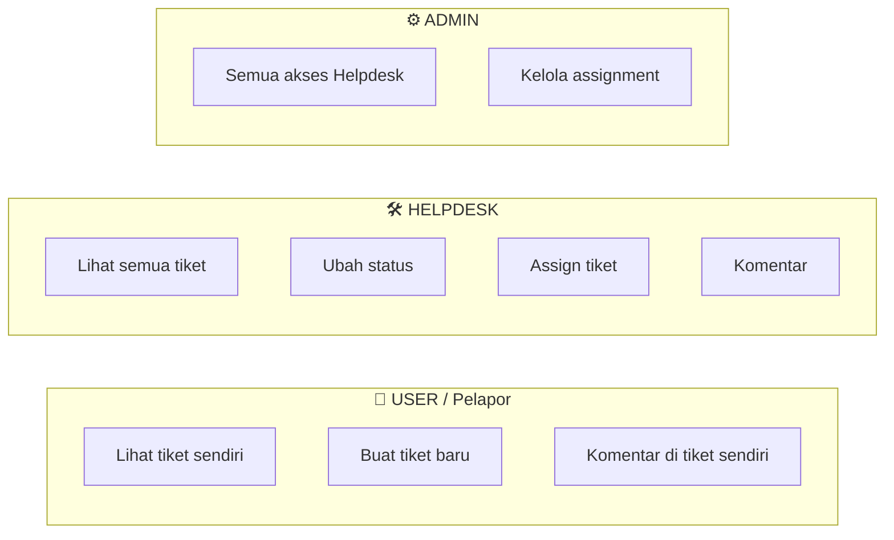

# Flow Diagram & Dokumentasi UI/UX — E-Ticketing Helpdesk UTS

**Versi:** 1.0.0
**Platform:** Native Android (Jetpack Compose + Material 3)
**Arsitektur:** MVVM (UI → ViewModel → UseCase → Repository)

Dokumen ini memuat **flow diagram aplikasi** (navigasi, autentikasi, siklus hidup tiket,
hak akses per-role) dan **deskripsi UI/UX tiap layar**. Diagram ditulis dalam format
[Mermaid](https://mermaid.live) sehingga dapat langsung dirender di GitHub atau diekspor
menjadi gambar untuk lampiran UAS.

---

## 1. Peta Navigasi Aplikasi

Aplikasi memiliki **11 layar** yang dikelola satu `NavHost` (lihat `MainActivity.kt`).





| Route | Layar | Akses |
|-------|-------|-------|
| `splash` | Splash | Publik |
| `login` | Login | Publik |
| `register` | Register | Publik |
| `reset_password` | Reset Password | Publik |
| `dashboard` | Dashboard | Semua role (login) |
| `ticket_list` | Daftar Tiket | Semua role (login) |
| `ticket_detail/{ticketId}` | Detail Tiket | Semua role (login) |
| `create_ticket` | Buat Tiket | USER |
| `profile` | Profil | Semua role (login) |
| `notifications` | Notifikasi | Semua role (login) |

---

## 2. Flow Autentikasi



**Catatan implementasi:** seluruh hasil aksi auth dikirim lewat satu state
`authMessage: StateFlow<String?>` di `TicketViewModel`, lalu ditampilkan sebagai banner
(`MessageBanner`) di tiap layar auth dan dibersihkan otomatis saat layar dibuka
(`clearAuthMessage()`).

---

## 3. Siklus Hidup Tiket (Ticket Lifecycle)





Setiap transisi status, assign, dan komentar otomatis menambah baris pada
**audit trail** (`ticket_activities`) dan dapat memicu **notifikasi**.

---

## 4. Hak Akses Berdasarkan Role



| Aksi | USER | HELPDESK | ADMIN |
|------|:----:|:--------:|:-----:|
| Lihat tiket sendiri | ✅ | ✅ | ✅ |
| Lihat **semua** tiket | ❌ | ✅ | ✅ |
| Buat tiket | ✅ | ❌ | ❌ |
| Ubah status | ❌ | ✅ | ✅ |
| Assign petugas | ❌ | ✅ | ✅ |
| Tambah komentar | ✅ | ✅ | ✅ |

Aturan ini ditegakkan di `TicketViewModel` (mis. `createTicket` menolak non-USER,
`updateStatus`/`assignTicket` menolak USER) dan pada filter `tickets` yang membatasi
daftar sesuai role.

---

## 5. Deskripsi UI/UX per Layar

Prinsip desain: **Material 3**, warna brand konsisten (lihat `ui/theme/Color.kt`),
spacing terstandardisasi (`ui/theme/Spacing.kt`), komponen reusable
(`ui/components/`), dan dukungan **mode gelap**.

### 5.1 Splash Screen
- **Tujuan:** branding singkat + menentukan tujuan awal (Dashboard/Login).
- **Elemen:** logo brand (`ic_splash_logo`), nama aplikasi, indikator.
- **UX:** tampil ±1.5 detik lalu auto-redirect sesuai status login; tidak bisa di-back.

### 5.2 Login
- **Elemen:** field username & password, tombol Login, tautan Daftar & Lupa Password, banner pesan.
- **UX:** validasi input kosong; pesan error/sukses lewat `MessageBanner`; password tersembunyi.

### 5.3 Register
- **Elemen:** field nama, username, email, password; tombol Daftar.
- **UX:** validasi semua field wajib, password minimal 6 karakter, cek duplikasi username/email; sukses → arahkan ke Login.

### 5.4 Reset Password
- **Elemen:** field email, tombol kirim instruksi.
- **UX:** verifikasi email terdaftar; umpan balik jelas via banner.

### 5.5 Dashboard
- **Elemen:** sapaan + role pengguna, ringkasan statistik tiket per status (OPEN/IN_PROGRESS/CLOSED), shortcut ke daftar tiket / buat tiket / notifikasi / profil, badge jumlah notifikasi belum dibaca.
- **UX:** titik masuk utama setelah login; kartu statistik memakai `StatusChip` berwarna.

### 5.6 Daftar Tiket (Ticket List)
- **Elemen:** daftar kartu tiket (judul, status chip, pembuat, tanggal), state kosong (`EmptyState`).
- **UX:** isi daftar otomatis difilter sesuai role; tap kartu → Detail Tiket.

### 5.7 Detail Tiket
- **Elemen:** info lengkap tiket, audit trail aktivitas, daftar komentar, input komentar; kontrol status & assign (khusus Helpdesk/Admin).
- **UX:** kontrol berubah sesuai role; komentar & perubahan langsung tercermin di timeline.

### 5.8 Buat Tiket (Create Ticket)
- **Elemen:** field judul & deskripsi, pilihan lampiran (NONE/CAMERA/FILE), tombol simpan.
- **UX:** hanya untuk USER; validasi panjang judul/deskripsi; sukses → kembali ke daftar dengan tiket baru berstatus OPEN.

### 5.9 Profil
- **Elemen:** identitas pengguna, toggle mode gelap, tombol logout.
- **UX:** toggle tema langsung diterapkan ke seluruh aplikasi; logout mengembalikan ke Login.

### 5.10 Notifikasi
- **Elemen:** daftar notifikasi (judul, pesan, waktu, status baca), aksi "tandai semua dibaca".
- **UX:** badge belum-dibaca sinkron dengan Dashboard; item terbaca berubah gaya visual.

### 5.11 Komponen Reusable
| Komponen | Fungsi |
|----------|--------|
| `BrandLogo` | Logo brand konsisten di splash & auth |
| `Buttons` | Tombol primer/sekunder seragam |
| `MessageBanner` | Banner pesan sukses/error |
| `SectionHeader` | Judul section seragam |
| `StatusChip` | Chip warna status tiket |
| `EmptyState` | Tampilan saat data kosong |

---

## 6. Cara Render Diagram untuk Lampiran UAS

1. Buka [mermaid.live](https://mermaid.live).
2. Salin blok ```mermaid``` dari dokumen ini.
3. Export **PNG/SVG** lalu sisipkan ke laporan UAS.

> Di GitHub, blok Mermaid otomatis dirender saat file `.md` dibuka — cukup screenshot tampilannya.
